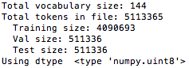
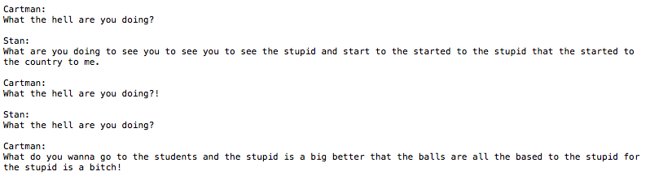
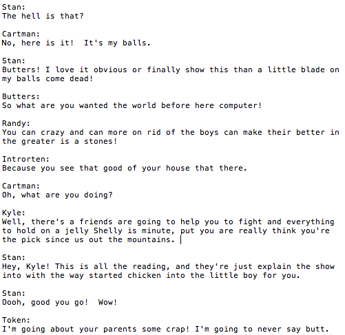
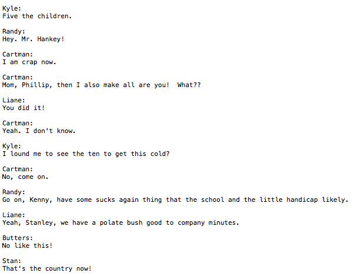
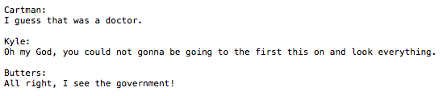
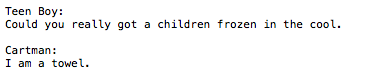
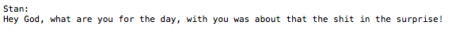

# SouthPark-rnn
## Feeding a neural network 19 seasons of South Park

###Acknowledgments
This was my first time experimenting with anything machine learning and couldn't have been done without [torch-rnn](https://github.com/jcjohnson/torch-rnn), the help of this guide [here](http://www.jeffreythompson.org/blog/2016/03/25/torch-rnn-mac-install/) by Jeffrey Thompson, and of course the massive collection of data cleaned and compiled by Bob Adams [here](https://github.com/BobAdamsEE/SouthParkData). 

### Training a model on 19 seasons
After a series of hiccups setting up torch-rnn on my macbook, I decided to put it to the test and trained it on a single season of South Park at first. The results were hardly coherent with the occasional whole word or phrase shining through. I don't think I got a screen grab of that but it was basically trash. 

So, I cleaned up the Bob Adams .csv (linked above) into a fat plaintext file you can find in the repository under `/data/sp-big.txt` and preprocessed it.

Training the model took roughly 7 hours without enabling GPU acceleration. Thankfully it didn't melt my laptop, and I think I could have been multitasking during the process. 

## Results

*Note: 10 samples at different temperatures can be found [in the repository](https://github.com/deankeinan/SouthPark-rnn/tree/master/Samples).*

Sampling the text produced some interesting results, especially while varying the 	
`-temperature` flag (which varies the level of noise in the sample generation). 

At lower temperatures we see little to no spelling errors but highly repetitive phrasing, as you can see here:

Common words/phrases at this level: `"What the hell are you doing?", "Country", "Balls"`

Steadily increasing the temperature, we get more variance in phrasing but more spelling errors. I found at `temperature -0.7` the balance felt just right. 

Definitely fun to read through samples here, and maybe I could find a silly use for them. Being a fan of the show it's fun subvocalizing the nonsense in the voices of the characters. In the repository I've included a 60,000 length sample at this temperature in case anyone is looking for inspiration.

###Moving forward
After 19 seasons, you still see occasional strings of nonsense text mid-dialogue even at lower temperatures. Part of this I'm attributing to the inclusion of songs and emotive phrasing in the data. (i.e "But mommmm!")

I see a few methods of getting more satisfying results and most of them involve manipulating the data to narrow the view of the training model.
-Limiting the data to one character (Cartman, for example)
-Removing non-major characters lines
-Removing songs and non-english words

With more research into making my own RNN for this type of project, maybe I could gear one specifically to deal with the caveats of reading scripts with multiple characters.

Enjoy!

##Highlights

*****

*****

*****

*****

And I'm sure there's more funny ones in there I haven't seen. 

