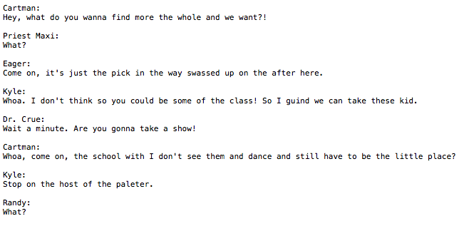

# SouthPark-rnn
## Feeding a neural network 19 seasons of South Park

### Acknowledgments
This was my first time experimenting with anything machine learning and couldn't have been done without [torch-rnn](https://github.com/jcjohnson/torch-rnn), the help of this guide [here](http://www.jeffreythompson.org/blog/2016/03/25/torch-rnn-mac-install/) by Jeffrey Thompson, and of course the massive collection of data cleaned and compiled by Bob Adams [here](https://github.com/BobAdamsEE/SouthParkData). 

### Goal
Inspired by the guides above, I wanted to follow the same procedure, but using transcripts from South Park episodes as the corpus. An ultimate goal would be to witness a true-to-character conversation between two or more characters. Given my limited insight on machine learning, I ran the experiment to satisfy curiosity and am sharing the results. Going forward, I hope to revisit this.

### Procedure
I followed the torch-rnn guide for Mac linked above almost the entire way through. I converted the Bob Adams .csv (also linked above) into a large .txt file containing a transcript from every season. It's a series of character names followed by dialogue, separated by line breaks. The preprocessing script:

`python scripts/preprocess.py --input_txt data/big-sp.txt --output_h5 data/big-sp.h5 --output_json data/big-sp.json`

Then to train the model:

`th train.lua -input_h5 data/big-sp.h5 -input_json data/big-sp.json -gpu -1`

The process took 7 hours without GPU acceleration and thankfully, did not melt my laptop like I expected.

Finally, the sampling:

` th sample.lua -checkpoint cv/checkpoint_81800.t7 -length 2000 -gpu -1 -temperature 0.7 > ~/Dev/SouthPark-rnn/samples/temp0.7/sample_1.txt`

However, this varied sample to sample.

## Results

*Note: 10 samples at different temperatures can be found [in the repository](https://github.com/deankeinan/SouthPark-rnn/tree/master/Samples).*

Sampling the text produced some interesting results, especially while varying the 	
`-temperature` flag (which varies the level of noise in the sample generation). 

At lower temperatures we see little to no spelling errors but highly repetitive phrasing, as you can see here:

Common words/phrases at this level: `"What the hell are you doing?", "Country", "Balls"`

Steadily increasing the temperature, we get more variance in phrasing but more spelling errors. I found at `temperature -0.7` the balance felt just right. 

Definitely fun to read through the nonsense samples here, and maybe I could find a silly use for them. Being a fan of the show it's fun subvocalizing the nonsense in the voices of the characters. In the repository I've included a 60,000 length sample at this temperature in case anyone is looking for inspiration.

###Final Thoughts
After 19 seasons of text (roughly 5.1MB) the nonsense is of a very high degree even at lower temperatures. I mostly attribute this to the fact that I fed the entire bulk text into torch-rnn without prior manipulation and entirely experimentally.

I see a few methods of getting more satisfying results and most of them involve manipulating the data to narrow the view of the training model.
- Limiting the data to one character
- Removing non-major characters lines
- Removing songs, non-english words, and emotive phrasing in the data. (i.e "But mommmm!")

With more research into making my own RNN for this type of project, maybe I could gear one specifically to deal with the caveats of reading scripts with multiple characters.

Enjoy!

##Highlights

*****

*****

*****

*****

And I'm sure there's more entertaining ones in there I haven't seen. 
